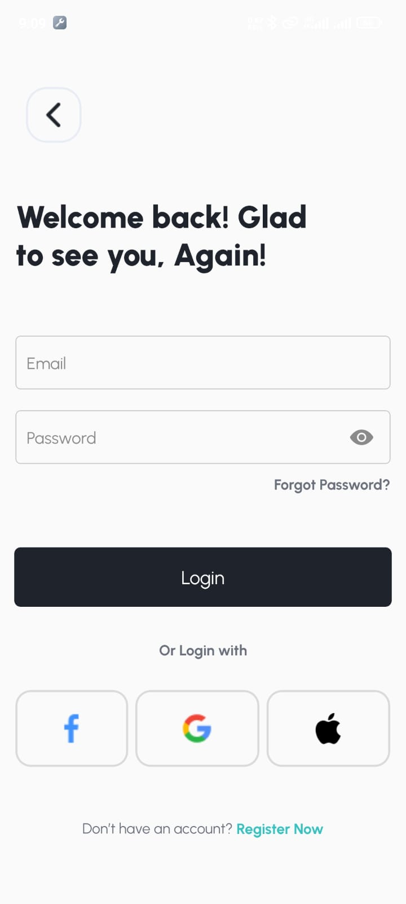
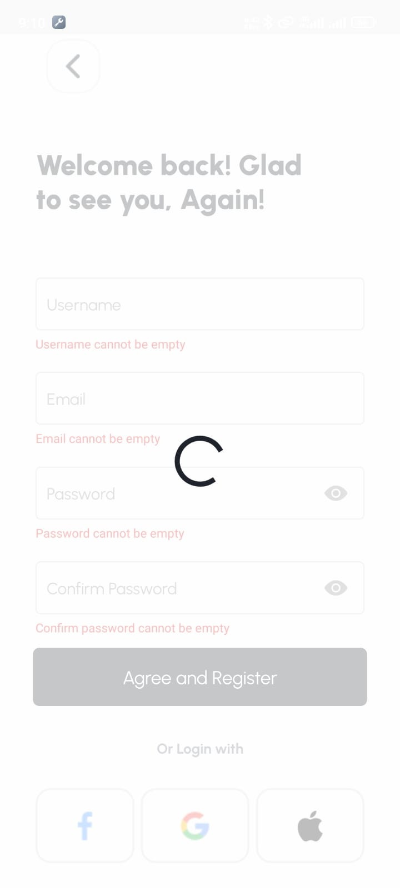
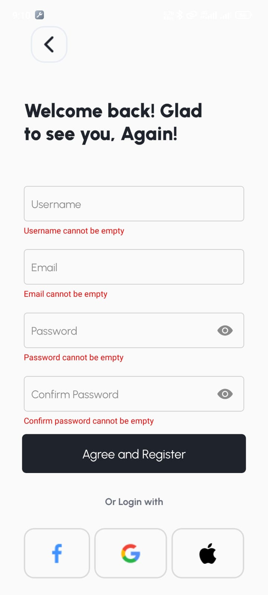
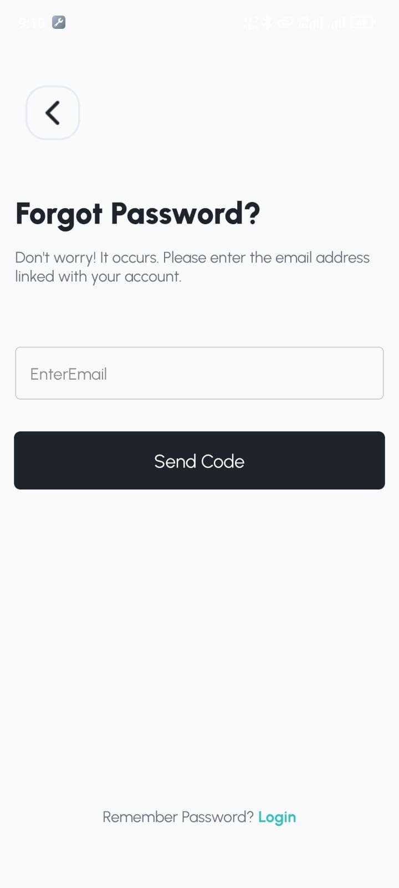
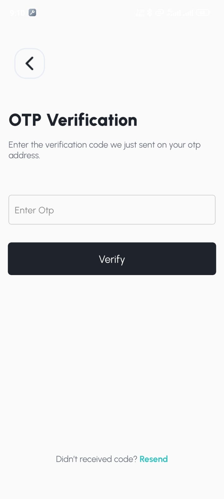
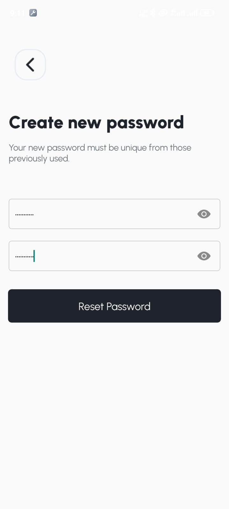
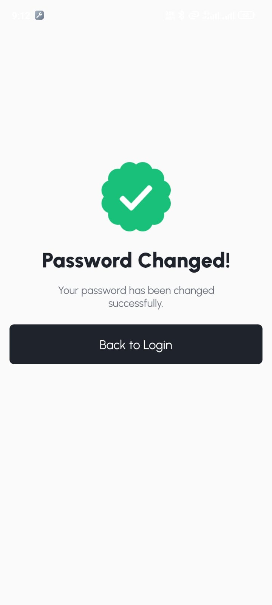

# Login System with Authentication

<!--  -->


## Overview

This project is a comprehensive and secure login system with a beautiful user interface (UI) tailored for mobile devices. It includes features such as user registration, login, OTP verification, password reset, and more. The system is designed to provide a smooth and user-friendly experience while ensuring high levels of security.

## Features

- **User Registration**: Allows new users to register by providing necessary information.
- **User Login**: Secure login using email and password.
- **OTP Verification**: Two-factor authentication using OTP (One-Time Password) sent via email or SMS.
- **Forgot Password**: Users can request a password reset link to reset their password.
- **Password Reset**: A secure way to reset passwords using a reset link.
- **Logout**: Secure logout option for users.
- **User-Friendly UI**: Intuitive and attractive user interface to enhance user experience.

## Demo

Below are some screenshots of the system:

<div style="display: flex; flex-direction: row; flex-wrap: wrap; gap: 10px">







<div>
## Installation

1. Clone the repository:
   ```bash
   git clone https://github.com/iammalikkhalil/login-system.git
   ```
2. Navigate to the project directory:
   ```bash
   cd login-system
   ```
3. Install the necessary dependencies:
   ```bash
   npm install
   ```
4. Configure environment variables for the email service, OTP, database, etc.
5. Run the development server:
   ```bash
   npm start
   ```
6. Open your mobile device emulator or connect your physical device to see the application in action.

## Usage

1. **Register**: Click on the "Register" button to create a new account.
2. **Login**: Use your registered email and password to log in.
3. **OTP Verification**: Enter the OTP received via email/SMS for additional security.
4. **Forgot Password**: If you forget your password, click on the "Forgot Password" link and follow the instructions.
5. **Reset Password**: Use the reset link received in your email to set a new password.
6. **Logout**: Click on the "Logout" button to safely exit the application.

## Technologies Used

- **Frontend**: React Native for mobile interface, ensuring a smooth and responsive UI.
- **Backend**: Node.js and Express.js for handling authentication and other server-side operations.
- **Database**: MongoDB for storing user data securely.
- **Authentication**: JWT (JSON Web Token) for secure user authentication.
- **OTP**: Integrated OTP generation and verification for two-factor authentication.
- **Email Service**: Nodemailer for sending emails for password resets and OTPs.

## Contributing

1. Fork the repository.
2. Create your feature branch: `git checkout -b feature/your-feature-name`.
3. Commit your changes: `git commit -m 'Add some feature'`.
4. Push to the branch: `git push origin feature/your-feature-name`.
5. Open a pull request.

## License

This project is licensed under the MIT License. See the [LICENSE](LICENSE) file for more details.

## Contact

For any questions or feedback, please reach out to iammalikkhalil@outlook.com.

Connect with me on [GitHub](https://github.com/iammalikkhalil), [LinkedIn](https://www.linkedin.com/in/iammalikkhalil), and other social media platforms using the username **iammalikkhalil**.

---

Thank you for using our Login System with Authentication!